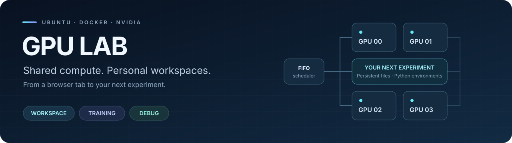
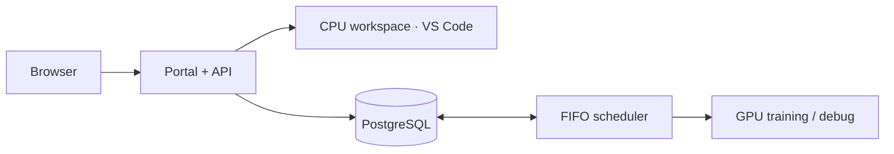

<div align="center">



<h1>GPU Lab</h1>

<p><strong>Turn one Ubuntu workstation into a shared GPU lab.</strong></p>
<p>Browser workspaces, queued training, and GPU debug sessions.<br />Persistent files, Python environments, and results for every student.</p>


[](README.md)
[](docs/README.zh-CN.md)

**[Quick start](#quick-start) · [GPU setup](#gpu-setup) · [Student workflow](#student-workflow) · [Documentation](#documentation)**

</div>

---

## At a glance

| Capability | What you get |
| --- | --- |
| **Browser workspaces** | VS Code via code-server, a dedicated Python environment, and persistent student files. |
| **Queued training** | A shared FIFO scheduler, GPU quotas, saved results, logs, and retries. |
| **Interactive GPU debug** | Automatic or explicit card selection, up to eight hours and one session per member. |
| **Live GPU monitoring** | Utilization, memory, temperature, power, and visibility into external compute processes. |
| **Environment templates** | Fixed Docker image versions, CUDA and nvcc, and a PyTorch development environment. |
| **Lab administration** | User management, workload controls, protected deletion, and retained audit records. |

Built with **React + TypeScript**, **FastAPI**, **PostgreSQL**, **Traefik**, and **Docker Compose**. Runs on a single Ubuntu host, with a public HTTPS tunnel for remote access.

## Quick start

### Prerequisites

| Requirement | Details |
| --- | --- |
| Host | Ubuntu x86_64 |
| Tools | Docker Engine with Compose, Bash, Python 3 |
| Storage | At least 30 GB, plus space for the optional PyTorch development image |
| Network | Internet access for the first build |
| Real GPU workloads | NVIDIA drivers and NVIDIA Container Toolkit; see [GPU setup](#gpu-setup) |

### Launch the lab

```bash
./scripts/lab.sh bootstrap
./scripts/lab.sh up --remote
```

Open the printed public `https://….trycloudflare.com` link, or `http://localhost:8080` on this PC. Log in as `admin` with `INITIAL_ADMIN_PASSWORD` from the private `.env` file. Bootstrap preserves existing passwords and data.

> [!NOTE]
> The public link changes when the tunnel restarts. The host and Docker must remain running.

### Everyday commands

```bash
./scripts/lab.sh remote-url          # Current public URL
./scripts/lab.sh remote-test         # Public HTTPS/editor/WebSocket acceptance
./scripts/lab.sh status
./scripts/lab.sh logs backend
./scripts/lab.sh down                # Stop services/workloads; preserve data
./scripts/lab.sh up --remote --no-build
```

Supply datasets with `./scripts/lab.sh bootstrap --dataset-path /absolute/datasets` before startup. Containers see them read-only at `/datasets`. User files/results live under `runtime/`; Python environments and PostgreSQL use persistent Docker volumes.

## GPU setup

The host has four RTX 5060 Ti GPUs. NVIDIA drivers and the [NVIDIA Container Toolkit](https://docs.nvidia.com/datacenter/cloud-native/container-toolkit/install-guide.html) are required. The setup script installs the toolkit and restarts Docker; run it when workloads can be interrupted.

```bash
sudo ./scripts/setup-nvidia.sh
./scripts/lab.sh gpu-test
./scripts/lab.sh set-scheduler local-gpu-docker
./scripts/lab.sh test --gpu
```

Set `LOCAL_GPU_COUNT=4` in `.env` for this PC. Finish/cancel active workloads before switching. `LOCAL GPU MODE` in the portal means real GPU scheduling; `MOCK GPU MODE` means simulated slots. CPU workspaces do not receive GPUs. Slurm is not implemented.

## CUDA & PyTorch

```bash
./scripts/lab.sh torch-image
./scripts/lab.sh torch-test
```

`torch-image` pulls the official `pytorch/pytorch:2.7.1-cuda12.8-cudnn9-devel` and builds `lab-torch-dev:2.7.1-cu128` with code-server and persistent student venv support. `torch-test` compiles/runs a CUDA kernel and executes PyTorch matrix multiplication on all visible GPUs. [PyTorch 2.7 supports Blackwell with CUDA 12.8](https://pytorch.org/blog/pytorch-2-7/).

After building the PyTorch image, restart the backend to register its immutable template automatically. The available template matching `LAB_TORCH_IMAGE` is marked **新用户默认 · PyTorch** and selected for new accounts. On this deployed PC, use **CUDA 12.8 · nvcc · PyTorch 2.7.1**, version `2.7.1-cu128-editor`. Existing accounts keep their assigned template unless an administrator changes it while idle. A Python ABI change keeps the previous venv under `/opt/user-env/venv-backup-*` and creates a fresh compatible venv; old packages are not automatically reinstalled.

VS Code includes the Python extension. Its default interpreter is `/opt/user-env/venv/bin/python`, and new terminals activate that environment. The PyTorch template inherits PyTorch 2.7.1+cu128 from the image. Workspace sessions use CPU; CUDA becomes available when a GPU is allocated to debug or training. Interpreter setup follows the [VS Code Python settings](https://code.visualstudio.com/docs/python/settings-reference) and [code-server extension installation](https://coder.com/docs/code-server/FAQ).

## GPU monitoring

The overview shows all four GPU models, utilization, memory, temperature, power, clocks, driver version, PCI address and UUID. `gpu-monitor` samples NVIDIA utility counters every three seconds. The page distinguishes platform allocation from external compute processes; unavailable/stale measurements display a message and dashes. Automatic allocation skips cards with external compute processes. A selected busy card waits until it is free. If real telemetry is unavailable, GPU jobs wait for monitoring to recover.

The monitor starts automatically with `./scripts/lab.sh up --remote --no-build` in real GPU mode. It uses the `gpu` Compose profile, host PID visibility for NVML process enumeration, the host user's UID/GID for writing snapshots, dropped capabilities and a read-only root filesystem. It has no Docker socket. To check it: `sg docker -c 'docker compose --profile gpu logs --tail 30 gpu-monitor'`.

## Student workflow

### Create an account and start debugging

1. Log in as administrator and open **用户管理**.
2. Enter a username such as `student01`, display name and a generated password. Select role **成员**.
3. Select the **CUDA 12.8 · nvcc · PyTorch 2.7.1** fixed environment, set **GPU 上限** to **1**, and **调试时长上限** to **8 小时**.
4. Click **创建用户**, then **复制登录信息** and give the login details to the student.
5. The student logs in through the public link, opens **在线调试**, chooses automatic allocation or **指定显卡**, checks one GPU, and enters the duration in hours. For eight hours or less, click **开启调试**. Wait for **运行中**, then open **VS Code ↗**.

### Choose your GPUs

Training and debug require at least one GPU, with automatic allocation or manual selection of multiple cards up to the user's quota. Selections are persisted and reused by retries. API requests use `gpu_indices`, e.g. `requested_gpus=1, gpu_indices=[2]`; omit or send `null` for automatic allocation. A requested card is never silently substituted. Physical GPU indices correspond to the dashboard; a one-GPU container sees its assigned GPU as CUDA device 0.

### Session limits and resources

Debug is limited to eight hours (or a lower account limit), with one unfinished session per member, including queued or cancelling sessions. That session may use multiple GPUs within the account quota. Existing running sessions retain their original deadlines when updating. New training and debug requests default to 4 CPU threads and 4 GB RAM; memory inputs use GB. Duration starts when the container starts; expiry or **停止** releases the GPU, while closing the browser leaves the session running.

Members can **Kill** their own training; administrators can kill any training and extend its duration within the existing seven-day training limit. Each training row provides **打开日志** and **保存 TXT 日志**. Completed training/debug records and their task logs expire after seven days; workspace code, Python environments and output files are retained.

Administrators can save announcement drafts, preview and explicitly publish them. Members receive unread announcements while online or after logging in; the bottom **关闭** button records acknowledgment for that member.

### Verify CUDA in your session

In the debug VS Code terminal:

```bash
nvcc --version
nvidia-smi
python -c "import torch; print(torch.__version__, torch.version.cuda, torch.cuda.is_available()); print(torch.cuda.get_device_name(0)); print((torch.ones(2, device='cuda') + 1).cpu())"
```

## Administrator deletion

Only administrators see deletion controls, and the API enforces the same permission. Members may stop their workspace/debug session or cancel training while retaining their files and history.

- **用户管理 → 删除用户:** first disable the account and finish/cancel its workloads. Deletes its account, private workspace/results/cache, Python volume and workload records; retains the audit trail. The signed-in administrator cannot delete their own account.
- **删除工作区:** clears workspace files, Python volume and cache; retains the account, training results and task history. Stop all debug/training workloads first. The workspace can be started again with a fresh environment.
- **训练任务 / 在线调试 → 删除记录:** only finished/stopped records can be deleted. Removes the record and log, retaining workspace and result files.
- **环境模板 → 删除模板 / Docker 镜像 → 删除镜像:** templates still referenced by users or task records are protected. Images used by any container/template, or configured as cluster defaults, cannot be deleted. Image deletion removes all its tags without forcing removal or pruning other images.

Deletion prompts describe the affected data and require confirmation. Acceptance: `sg docker -c 'docker compose exec -T backend python3 integration/admin_deletion.py'` creates and deletes only disposable test resources; report is saved in `runtime/logs/acceptance-admin-deletion.json`.

## How it works



The API persists job requests in PostgreSQL; a separate scheduler worker allocates GPUs and launches workload containers. Workspaces use CPU, while training and debug share the GPU queue. User files and results live under `runtime/`, and Python environments use persistent Docker volumes. See the [architecture guide](docs/ARCHITECTURE.md) for routing, isolation, scheduling, and recovery details.

## Documentation

| Guide | Contents |
| --- | --- |
| [2026-10-08 portal update](docs/PORTAL_UPDATE_2026-10-08.md) | New controls, announcements and manual update/start script |
| [Remote access & student guide](docs/REMOTE_ACCESS.md) | Public links, login, and student workflows |
| [Ubuntu deployment](docs/UBUNTU_MIGRATION.md) | Host setup, configuration, and migration |
| [Verification results](docs/UBUNTU_VALIDATION.md) | Deployment checks and acceptance results |
| [Architecture](docs/ARCHITECTURE.md) | Services, storage, scheduling, and container isolation |
| [Implementation notes](docs/IMPLEMENTATION_NOTES.md) | Implementation details and project limitations |
| [简体中文 README](docs/README.zh-CN.md) | Complete Chinese version of this guide |

## Workspace startup recovery

If a workspace exits with `cp: cannot stat '/opt/lab/extensions/.': Permission denied`, use the updated base/PyTorch images: their public extension files and editor helpers are readable by members, with compatibility recovery for older pinned images. The existing-home `useradd` warning is harmless. See the [verified recovery and pending cleanup list](docs/WORKSPACE_RECOVERY_2026-10-07.md) for member mappings, preserved backups and the exact candidate names. No cleanup has been performed.
