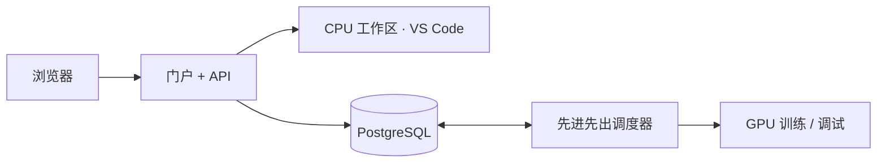

<div align="center">


<h1>GPU Lab · GPU 实验平台</h1>

<p><strong>将一台 Ubuntu 工作站变成共享 GPU 实验平台。</strong></p>
<p>通过浏览器使用工作区、排队训练和 GPU 在线调试。<br />为每位学生持久保存文件、Python 环境及运行结果。</p>


[](../README.md)
[](README.zh-CN.md)

**[快速开始](#快速开始) · [GPU 配置](#gpu-配置) · [学生使用流程](#学生使用流程) · [文档导航](#文档导航)**

</div>

---

## 功能概览

| 功能 | 提供的能力 |
| --- | --- |
| **浏览器工作区** | 通过 code-server 使用 VS Code，拥有独立 Python 环境和持久保存的学生文件。 |
| **排队训练** | 统一的先进先出调度器、GPU 配额、结果保存、日志和重试。 |
| **GPU 在线调试** | 自动分配或指定显卡、限时会话，以及超时长使用的审批流程。 |
| **实时 GPU 监控** | 利用率、显存、温度、功耗，以及外部计算进程的可见性。 |
| **环境模板** | 固定版本的 Docker 镜像、CUDA 和 nvcc，以及 PyTorch 开发环境。 |
| **实验平台管理** | 用户管理、工作负载控制、带保护机制的删除操作，以及保留的审计记录。 |

使用 **React + TypeScript**、**FastAPI**、**PostgreSQL**、**Traefik** 和 **Docker Compose** 构建。在单台 Ubuntu 主机上运行，通过公共 HTTPS 隧道提供远程访问。

## 快速开始

### 环境要求

| 要求 | 说明 |
| --- | --- |
| 主机 | Ubuntu x86_64 |
| 工具 | 支持 Compose 的 Docker Engine、Bash、Python 3 |
| 存储 | 至少 30 GB；可选的 PyTorch 开发镜像需要额外空间 |
| 网络 | 首次构建时需要互联网连接 |
| 真实 GPU 工作负载 | NVIDIA 驱动和 NVIDIA Container Toolkit，参见 [GPU 配置](#gpu-配置) |

### 启动平台

```bash
./scripts/lab.sh bootstrap
./scripts/lab.sh up --remote
```

打开命令输出的公共链接 `https://….trycloudflare.com`，或在本机访问 `http://localhost:8080`。使用用户名 `admin` 登录，密码为私有 `.env` 文件中的 `INITIAL_ADMIN_PASSWORD`。初始化会保留已有密码和数据。

> [!NOTE]
> 隧道重启后，公共链接会发生变化。主机和 Docker 必须保持运行。

### 常用命令

```bash
./scripts/lab.sh remote-url          # 查看当前公共访问地址
./scripts/lab.sh remote-test         # 验收公共 HTTPS、编辑器和 WebSocket 连接
./scripts/lab.sh status
./scripts/lab.sh logs backend
./scripts/lab.sh down                # 停止服务和工作负载，保留数据
./scripts/lab.sh up --remote --no-build
```

启动前，可使用 `./scripts/lab.sh bootstrap --dataset-path /absolute/datasets` 配置数据集路径。容器通过 `/datasets` 以只读方式访问数据集。用户文件和结果保存在 `runtime/` 下；Python 环境和 PostgreSQL 数据使用持久化 Docker 卷。

## GPU 配置

主机配备四张 RTX 5060 Ti 显卡，需要安装 NVIDIA 驱动和 [NVIDIA Container Toolkit](https://docs.nvidia.com/datacenter/cloud-native/container-toolkit/install-guide.html)。安装脚本会安装工具包并重启 Docker，请在允许中断工作负载时运行。

```bash
sudo ./scripts/setup-nvidia.sh
./scripts/lab.sh gpu-test
./scripts/lab.sh set-scheduler local-gpu-docker
./scripts/lab.sh test --gpu
```

在本机的 `.env` 中设置 `LOCAL_GPU_COUNT=4`。切换前，请先完成或取消正在运行的工作负载。门户中的 `LOCAL GPU MODE` 表示真实 GPU 调度，`MOCK GPU MODE` 表示模拟 GPU 槽位。CPU 工作区不会分配 GPU。目前未实现 Slurm 支持。

## CUDA 与 PyTorch

```bash
./scripts/lab.sh torch-image
./scripts/lab.sh torch-test
```

`torch-image` 会拉取官方镜像 `pytorch/pytorch:2.7.1-cuda12.8-cudnn9-devel`，并构建 `lab-torch-dev:2.7.1-cu128`，其中包含 code-server 和学生持久化 venv 支持。`torch-test` 会编译并运行 CUDA 内核，并在所有可见 GPU 上执行 PyTorch 矩阵乘法。[PyTorch 2.7 通过 CUDA 12.8 支持 Blackwell](https://pytorch.org/blog/pytorch-2-7/)。

构建 PyTorch 镜像后，重启后端即可自动注册其不可变环境模板。与 `LAB_TORCH_IMAGE` 匹配的可用模板会标记为 **新用户默认 · PyTorch**，并为新账号默认选中。在当前部署的主机上，请使用 **CUDA 12.8 · nvcc · PyTorch 2.7.1**，版本为 `2.7.1-cu128-editor`。已有账号会保留原先分配的模板，除非管理员在该账号没有运行任务时修改模板。Python ABI 发生变化时，旧 venv 会保留在 `/opt/user-env/venv-backup-*` 下，并创建新的兼容 venv；旧环境中的软件包不会自动重新安装。

VS Code 已安装 Python 扩展，默认解释器为 `/opt/user-env/venv/bin/python`，新终端会自动激活该环境。PyTorch 模板继承镜像中的 PyTorch 2.7.1+cu128。工作区会话使用 CPU；为调试或训练分配 GPU 后，CUDA 才可用。解释器配置遵循 [VS Code Python 设置](https://code.visualstudio.com/docs/python/settings-reference)和 [code-server 扩展安装说明](https://coder.com/docs/code-server/FAQ)。

## GPU 监控

概览页展示全部四张 GPU 的型号、利用率、显存、温度、功耗、风扇转速、时钟频率、驱动版本、PCI 地址及 UUID。`gpu-monitor` 每三秒采样一次 NVIDIA 工具计数器。页面会区分平台分配情况和外部计算进程；监测数据不可用或过期时，会显示提示和短横线。自动分配会跳过存在外部计算进程的显卡。指定的显卡忙碌时，任务会等待其空闲。真实监测数据不可用时，GPU 任务会等待监控恢复。

在真实 GPU 模式下，运行 `./scripts/lab.sh up --remote --no-build` 会自动启动监控服务。该服务使用 Compose 的 `gpu` 配置档案，通过主机 PID 可见性让 NVML 枚举进程，使用主机用户的 UID/GID 写入快照，并移除 Linux capabilities、采用只读根文件系统。它不挂载 Docker socket。可通过以下命令查看日志：`sg docker -c 'docker compose --profile gpu logs --tail 30 gpu-monitor'`。

## 学生使用流程

### 创建账号并开始调试

1. 以管理员身份登录，打开 **用户管理**。
2. 输入用户名（例如 `student01`）、显示名称和生成的密码，选择角色 **成员**。
3. 选择 **CUDA 12.8 · nvcc · PyTorch 2.7.1** 固定环境，将 **GPU 上限** 设为 **1**，将 **Debug 免审批上限** 设为 **10 小时**。
4. 点击 **创建用户**，再点击 **复制登录信息**，将登录信息交给学生。
5. 学生通过公共链接登录，打开 **在线调试**，选择自动分配或 **指定显卡**，勾选一张 GPU，并填写以小时为单位的时长。时长不超过十小时可直接点击 **开启调试**。等待状态变为 **运行中**，再打开 **VS Code ↗**。

### 选择 GPU

训练同样支持自动分配、在用户配额内选择多张显卡，或仅使用 CPU。显卡选择会持久保存，重试时继续使用。API 请求使用 `gpu_indices`，例如 `requested_gpus=1, gpu_indices=[2]`；省略该字段或发送 `null` 表示自动分配。用户指定的显卡不会被静默替换。物理 GPU 索引与概览页对应；仅分配一张 GPU 的容器会将该显卡显示为 CUDA 设备 0。

### 申请更长的会话

如需调试超过十小时（最多七天），请填写原因并点击 **提交审批申请**。会话会保持 **等待管理员审批** 状态，不占用 GPU 或容器，也不会阻塞运行队列。管理员在 **在线调试** 中查看时长、显卡和原因，点击 **批准** 或 **拒绝**，也可填写备注。只有批准后，申请才会进入按批准时间排序的先进先出队列。学生可在启动前 **撤回申请**。每次申请都需要单独审批；审批结果不能作为账号后续申请的通用授权。调试时长从容器启动时开始计算。到期或点击 **停止** 会释放 GPU；关闭浏览器不会取消会话。使用 PyTorch 时，请选择至少 4096 MB 内存。

迁移会将现有账号的时长上限提高至十小时。管理员可以为需要短时会话的账号设置更小的上限；申请超过十小时仍需明确审批。

### 在会话中验证 CUDA

在调试会话的 VS Code 终端中运行：

```bash
nvcc --version
nvidia-smi
python -c "import torch; print(torch.__version__, torch.version.cuda, torch.cuda.is_available()); print(torch.cuda.get_device_name(0)); print((torch.ones(2, device='cuda') + 1).cpu())"
```

## 管理员删除操作

只有管理员可以看到删除控件，API 也会执行相同的权限校验。成员可以停止工作区或调试会话，或取消训练，同时保留文件和历史记录。

- **用户管理 → 删除用户：** 先禁用账号，并完成或取消其工作负载。此操作会删除账号、私有工作区、结果、缓存、Python 卷及工作负载记录，但保留审计记录。当前登录的管理员不能删除自己的账号。
- **删除工作区：** 清空工作区文件、Python 卷及缓存，保留账号、训练结果和任务历史。操作前须停止所有调试和训练工作负载。之后可以重新启动工作区，创建全新环境。
- **训练任务 / 在线调试 → 删除记录：** 只能删除已完成或已停止的记录。此操作会删除记录及日志，保留工作区和结果文件。
- **环境模板 → 删除模板 / Docker 镜像 → 删除镜像：** 仍被用户或任务记录引用的模板受到保护。被任何容器或模板使用的镜像，以及配置为集群默认镜像的镜像，均不能删除。删除镜像会移除其所有标签，不会强制删除，也不会清理其他镜像。

删除提示会说明受影响的数据，并要求确认。验收命令 `sg docker -c 'docker compose exec -T backend python3 integration/admin_deletion.py'` 仅创建和删除一次性测试资源；报告保存在 `runtime/logs/acceptance-admin-deletion.json`。

## 工作原理



API 将任务请求持久保存到 PostgreSQL，独立的调度工作进程负责分配 GPU 并启动工作负载容器。工作区使用 CPU，训练和调试共享 GPU 队列。用户文件和结果保存在 `runtime/` 下，Python 环境使用持久化 Docker 卷。路由、隔离、调度和恢复机制的详细说明见[架构文档](ARCHITECTURE.md)。

## 文档导航

| 指南 | 内容 |
| --- | --- |
| [公共访问和学生使用说明](REMOTE_ACCESS.md) | 公共链接、登录和学生使用流程 |
| [Ubuntu 部署](UBUNTU_MIGRATION.md) | 主机配置、设置和迁移 |
| [验证结果](UBUNTU_VALIDATION.md) | 部署检查和验收结果 |
| [架构](ARCHITECTURE.md) | 服务、存储、调度和容器隔离 |
| [实现说明](IMPLEMENTATION_NOTES.md) | 实现细节和项目限制 |
| [English README](../README.md) | 本指南的完整英文版本 |
